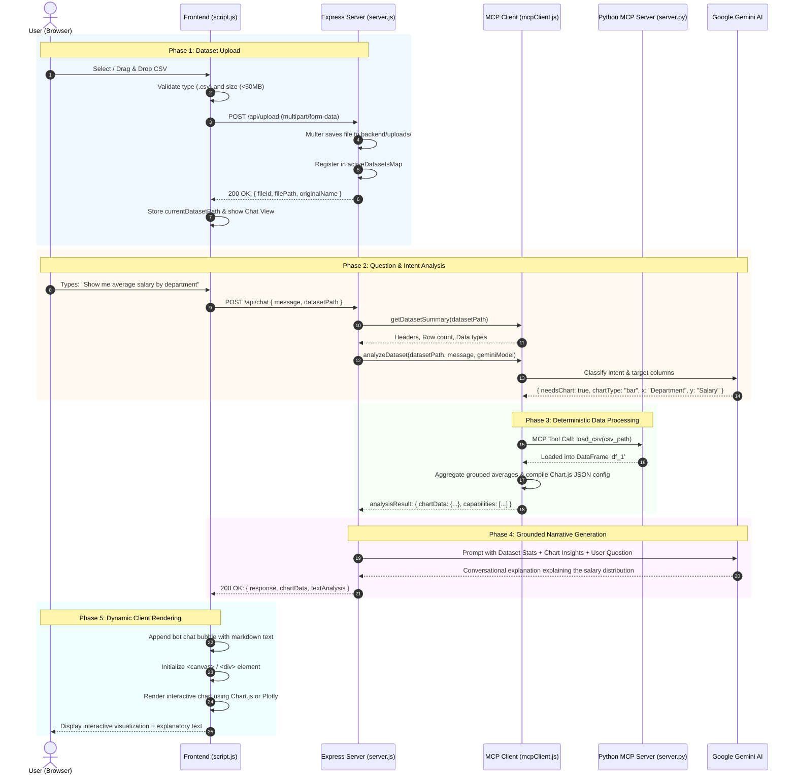

# System Architecture & Module Guide: MCP Data Analyst

> [!NOTE]
> **Welcome to the Project!** This guide is designed to help new team members and contributors quickly understand the architecture, module breakdown, and end-to-end data flow of the **MCP Data Analyst Chatbot** system without getting lost in implementation minutiae.

---

## Table of Contents
1. [Executive Overview](#1-executive-overview)
2. [High-Level System Architecture](#2-high-level-system-architecture)
3. [End-to-End Data Flow](#3-end-to-end-data-flow)
   - [A. File Upload & Ingestion Flow](#a-file-upload--ingestion-flow)
   - [B. Query Processing & Intent Analysis Flow](#b-query-processing--intent-analysis-flow)
   - [C. MCP Analytical Tool Execution Flow](#c-mcp-analytical-tool-execution-flow)
   - [D. AI Narrative Synthesis Flow](#d-ai-narrative-synthesis-flow)
   - [E. Dynamic Visual Rendering Flow](#e-dynamic-visual-rendering-flow)
   - [Step-by-Step Practical Walkthrough](#step-by-step-practical-walkthrough-salary-by-department)
4. [System Modules & Sub-Modules Breakdown](#4-system-modules--sub-modules-breakdown)
   - [Module 1: Frontend Layer (Browser UI)](#module-1-frontend-layer-browser-ui)
     - [Sub-Module 1.1: Presentation Structure (`index.html`)](#sub-module-11-presentation-structure-indexhtml)
     - [Sub-Module 1.2: Style System (`styles.css`)](#sub-module-12-style-system-stylescss)
     - [Sub-Module 1.3: Client Controller & Chart Engine (`script.js`)](#sub-module-13-client-controller--chart-engine-scriptjs)
   - [Module 2: Backend API & Gateway Layer (`server.js`)](#module-2-backend-api--gateway-layer-serverjs)
     - [Sub-Module 2.1: HTTP Routing & Middleware](#sub-module-21-http-routing--middleware)
     - [Sub-Module 2.2: File Ingestion & Storage Manager (Multer)](#sub-module-22-file-ingestion--storage-manager-multer)
     - [Sub-Module 2.3: In-Memory Dataset Session Registry](#sub-module-23-in-memory-dataset-session-registry)
     - [Sub-Module 2.4: Response Assembler & Error Gateway](#sub-module-24-response-assembler--error-gateway)
   - [Module 3: MCP Client & Analysis Orchestrator (`mcpClient.js`)](#module-3-mcp-client--analysis-orchestrator-mcpclientjs)
     - [Sub-Module 3.1: Dataset Inspection & CSV Profiler](#sub-module-31-dataset-inspection--csv-profiler)
     - [Sub-Module 3.2: AI Intent Classifier & Query Parser](#sub-module-32-ai-intent-classifier--query-parser)
     - [Sub-Module 3.3: Statistical & Correlation Engine](#sub-module-33-statistical--correlation-engine)
     - [Sub-Module 3.4: Chart Configuration Factory](#sub-module-34-chart-configuration-factory)
     - [Sub-Module 3.5: Text Analysis Synthesizer](#sub-module-35-text-analysis-synthesizer)
     - [Sub-Module 3.6: Python Execution Bridge](#sub-module-36-python-execution-bridge)
   - [Module 4: Python MCP Data Science Server (`server.py`)](#module-4-python-mcp-data-science-server-serverpy)
     - [Sub-Module 4.1: MCP Protocol Server & Transport](#sub-module-41-mcp-protocol-server--transport)
     - [Sub-Module 4.2: MCP Tool Registry & Schemas](#sub-module-42-mcp-tool-registry--schemas)
     - [Sub-Module 4.3: In-Memory DataFrame Store (`ScriptRunner`)](#sub-module-43-in-memory-dataframe-store-scriptrunner)
     - [Sub-Module 4.4: Sandboxed Python Execution Engine](#sub-module-44-sandboxed-python-execution-engine)
     - [Sub-Module 4.5: Prompt Templates & Resource Provider](#sub-module-45-prompt-templates--resource-provider)
   - [Module 5: External AI Intelligence Layer (Google Gemini API)](#module-5-external-ai-intelligence-layer-google-gemini-api)
     - [Sub-Module 5.1: Semantic Query Disambiguation](#sub-module-51-semantic-query-disambiguation)
     - [Sub-Module 5.2: Grounded Data Storytelling](#sub-module-52-grounded-data-storytelling)
5. [Data Contracts & API Interfaces](#5-data-contracts--api-interfaces)
6. [Developer Mental Model & Key Concepts](#6-developer-mental-model--key-concepts)

---

## 1. Executive Overview

### What is this system?
The **MCP Data Analyst** is an intelligent conversational data exploration platform. Users upload tabular datasets (CSV files) and interact through natural language questions such as:
- *"Show me a bar chart of average salary by department."*
- *"Are experience and bonus correlated?"*
- *"Who is the highest earner in marketing?"*

Instead of relying solely on an LLM to guess numbers, the system uses a **hybrid architecture**:
1. **Deterministic Analytics**: It computes accurate statistics and prepares chart configurations using Python (`pandas`, `numpy`, `scipy`) via the **Model Context Protocol (MCP)**.
2. **Generative Storytelling**: It uses **Google Gemini 2.5 Flash** to interpret user intent and narrate insights in clear, natural language.
3. **Interactive Visualizations**: It automatically renders charts in the browser using **Chart.js** and **Plotly.js**.

---

## 2. High-Level System Architecture

The following diagram illustrates how the system is partitioned across client, server, protocol, compute, and external AI boundaries:

```mermaid
flowchart TB
    %% Users & Frontend
    subgraph Frontend ["1. Frontend Layer (Browser)"]
        UI_Upload["Upload Zone (Drag-Drop / File Picker)"]
        UI_Chat["Chat Interface (Input & Bubble Stream)"]
        UI_Chart["Visualization Viewports (Chart.js & Plotly)"]
        UI_Controller["Client Controller & State (script.js)"]
        
        UI_Upload --> UI_Controller
        UI_Chat --> UI_Controller
        UI_Controller --> UI_Chart
    end

    %% Backend Gateway
    subgraph BackendGateway ["2. Backend API Gateway (Node.js/Express)"]
        API_Upload["/api/upload (Multer Upload Engine)"]
        API_Chat["/api/chat (Chat Orchestration)"]
        DatasetMap["In-Memory Dataset Registry (activeDatasetsMap)"]
        DiskUploads["Disk Storage (backend/uploads/*.csv)"]
        
        API_Upload --> DiskUploads
        API_Upload --> DatasetMap
        API_Chat -. reads .-> DatasetMap
    end

    %% MCP Orchestrator
    subgraph Orchestrator ["3. MCP Client & Analysis Layer (Node.js)"]
        Profiler["Dataset Profiler & CSV Reader"]
        IntentClassifier["Intent & Column Classifier"]
        ChartFactory["Chart Configuration Factory"]
        StatEngine["Statistical & Correlation Engine"]
        PythonBridge["Python Subprocess / MCP Transport Bridge"]
        
        API_Chat --> Profiler
        API_Chat --> IntentClassifier
        IntentClassifier --> ChartFactory
        IntentClassifier --> StatEngine
        StatEngine --> PythonBridge
    end

    %% Python MCP Server
    subgraph ComputeEngine ["4. MCP Data Science Server (Python stdio)"]
        MCPServer["MCP Protocol Server (local-mini-ds)"]
        Tool_LoadCSV["Tool: load_csv (Pandas loader)"]
        Tool_RunScript["Tool: run_script (Sandboxed Runner)"]
        DFStore["DataFrame Memory Store (df_1, df_2, ...)"]
        PythonLibs["Data Science Stack (NumPy, SciPy, Scikit-Learn)"]
        
        MCPServer --> Tool_LoadCSV
        MCPServer --> Tool_RunScript
        Tool_LoadCSV --> DFStore
        Tool_RunScript --> DFStore
        Tool_RunScript --> PythonLibs
    end

    %% External AI
    subgraph ExternalAI ["5. External AI Service (Google Cloud)"]
        GeminiFlash["Google Gemini 2.5 Flash API"]
    end

    %% Inter-tier Connections
    UI_Controller -- "HTTP POST (multipart/form-data)" --> API_Upload
    UI_Controller -- "HTTP POST (JSON: query + path)" --> API_Chat
    
    IntentClassifier <-->|Intent Classification & Schema Extraction| GeminiFlash
    API_Chat <-->|Narrative Generation with Grounded Context| GeminiFlash
    
    PythonBridge <-->|JSON-RPC via stdio (MCP Protocol)| MCPServer
    
    API_Chat -- "JSON Response: {response, chartData, textAnalysis}" --> UI_Controller
```

### Architectural Tier Summary

| Tier | Primary Technology | Core Function |
| :--- | :--- | :--- |
| **Frontend Layer** | Vanilla HTML5, CSS3, ES6 JavaScript, Chart.js, Plotly.js | Handles user interaction, file drag-and-drop, message history, and reactive chart rendering. |
| **Backend Gateway** | Node.js, Express.js, Multer | Enforces file size/type constraints, serves static assets, and manages dataset sessions. |
| **MCP Orchestration** | Node.js (`mcpClient.js`) | Coordinates query parsing, data profiling, chart config compilation, and MCP bridge calls. |
| **Data Science Engine** | Python 3.10+, MCP SDK, Pandas, NumPy, SciPy, Scikit-learn | Loads datasets into memory and executes sandboxed analytical scripts with zero hallucination risk. |
| **Cognitive AI Layer** | `@google/generative-ai` (`gemini-2.5-flash`) | Disambiguates user language and synthesizes conversational explanations based on actual computed data. |

---

## 3. End-to-End Data Flow

The following sequence diagram outlines the entire lifecycle of an analytical request, from file upload to final chart display:



### Detailed Flow Descriptions

#### A. File Upload & Ingestion Flow
1. **Client-side Filter**: The user drops a CSV file into `uploadArea`. `script.js` validates that the filename ends with `.csv` and does not exceed 50 MB.
2. **Progress Monitoring**: An `XMLHttpRequest` sends the file as `multipart/form-data` to `/api/upload`, updating a visual progress bar.
3. **Server Sanitization & Storage**: Multer intercepts the upload, sanitizes the filename by stripping non-alphanumeric characters, prepends a millisecond timestamp to eliminate collisions, and writes the stream to `backend/uploads/`.
4. **Session Registration**: The server registers an entry in `activeDatasetsMap` keyed by `fileId`.
5. **View Transition**: The frontend transitions smoothly from the upload drop zone to the conversational chat interface.

#### B. Query Processing & Intent Analysis Flow
1. **Message Dispatch**: When the user enters a question, `script.js` disables the input field, activates the typing animation, and issues a `POST /api/chat` with `{ message, datasetPath }`.
2. **Metadata Inspection**: The server reads the first few rows of the CSV to extract headers, data types, and estimated row counts via `getDatasetSummary`.
3. **Intent Classification**: `mcpClient.extractColumnsFromQuestion` queries Gemini with the dataset schema to determine:
   - Does this request require a visual chart or text response?
   - What is the most appropriate chart type (`bar`, `line`, `scatter`, `pie`, `histogram`, `heatmap`, or `none`)?
   - Which columns represent the independent (`x`) and dependent (`y`) variables?

#### C. MCP Analytical Tool Execution Flow
1. **MCP Tool Invocation**: If advanced statistical processing or custom transformations are needed, the backend communicates with the Python MCP Server over standard input/output (`stdio`).
2. **DataFrame Ingestion**: The Python server's `load_csv` tool imports the file into a cached pandas DataFrame.
3. **Calculations**: Aggregations (sums, averages, counts, distributions, or Pearson correlation matrices) are calculated deterministically by Python/Node.
4. **Chart Configuration Assembly**: `generateChartData` compiles a clean JSON structure ready for Chart.js or Plotly.js.

#### D. AI Narrative Synthesis Flow
1. **Grounded Prompt Construction**: `server.js` builds a prompt incorporating:
   - Dataset metadata (filename, row count, columns).
   - Pre-computed analytical findings.
   - Strict instructions forbidding raw JSON dumps or chart configuration code.
2. **Insight Generation**: Gemini 2.5 Flash generates a conversational, natural-language explanation highlighting trends, outliers, and takeaways.

#### E. Dynamic Visual Rendering Flow
1. **Payload Reception**: The browser receives `{ response, chartData, textAnalysis }`.
2. **Message Formatting**: Text is sanitized and rendered with markdown formatting.
3. **Chart Instantiation**: If `chartData` is present:
   - For heatmaps: A `<div>` is dynamically created and rendered via `Plotly.newPlot()`.
   - For bar, line, scatter, pie, or histograms: A `<canvas>` element is mounted and rendered via `new Chart(canvasElement, chartData.config)`.

---

### Step-by-Step Practical Walkthrough: "Salary by Department"

To see how all pieces connect in practice, follow a single user query:

```text
User Question: "What is the average salary by department?"
```

```
[1. Browser]  User types question -> script.js packages message & dataset path.
     │
     ▼
[2. server.js] Receives POST /api/chat -> passes to mcpClient.analyzeDataset().
     │
     ▼
[3. mcpClient] Calls Gemini with headers ["Name", "Department", "Salary", "Experience"]
               -> Gemini responds: { needsChart: true, chartType: "bar", 
                                     x: "Department", y: "Salary", aggregation: "average" }
     │
     ▼
[4. Analytics] Group rows by "Department", compute mean of "Salary"
               -> Produces labels: ["Engineering", "Marketing", "Sales"]
               -> Produces values: [95000, 72000, 68000]
               -> Constructs Chart.js JSON config object.
     │
     ▼
[5. Gemini AI] Prompted: "Dataset has 3 departments. Eng avg is $95k, Mkt is $72k, Sales is $68k.
               Explain this to the user."
               -> Generates: "Engineering leads with an average salary of $95,000, 
                  followed by Marketing at $72,000 and Sales at $68,000..."
     │
     ▼
[6. Browser]  Receives response -> Displays Gemini narrative in chat bubble
               -> Instantiates Chart.js bar chart showing the comparison visually.
```

---

## 4. System Modules & Sub-Modules Breakdown

The codebase is organized into five dedicated modules. Each module contains focused sub-modules with clear single-responsibility boundaries.

```
data-analysis-chatbot/
├── index.html              <-- Module 1.1: Presentation Structure
├── styles.css              <-- Module 1.2: Design System & Styling
├── script.js               <-- Module 1.3: Client Controller & Chart Engine
├── backend/
│   ├── server.js           <-- Module 2: Backend API Gateway
│   ├── mcpClient.js        <-- Module 3: MCP Client & Orchestrator
│   └── uploads/            <-- Managed by Module 2.2
src/
└── mcp_server_ds/
    └── server.py           <-- Module 4: Python MCP Data Science Engine
External:
└── Google Gemini API       <-- Module 5: Cognitive AI Service
```

---

### Module 1: Frontend Layer (Browser UI)

The frontend provides a zero-dependency, responsive single-page web interface. It requires no build step and runs directly in modern browsers.

#### Sub-Module 1.1: Presentation Structure (`index.html`)
- **Purpose**: Defines semantic DOM layouts for application states.
- **Key Sections**:
  - **Upload View (`#uploadSection`)**: Contains `#uploadArea` for drag-and-drop file ingestion, hidden file input, and file metadata preview cards.
  - **Chat View (`#chatSection`)**: Displays dataset badge, persistent header, and scrollable message viewport (`#chatMessages`).
  - **Input Bar (`.chat-input-section`)**: Houses `#chatInput` with Enter-key dispatch, suggestion chips, and animated typing indicator (`#typingIndicator`).
- **Dependencies**: FontAwesome (icons), Google Fonts (Inter), Chart.js (CDN), Plotly.js (CDN).

#### Sub-Module 1.2: Style System (`styles.css`)
- **Purpose**: Provides visual hierarchy, animations, and responsive layouts.
- **Key Components**:
  - **Design Tokens**: Centralized color palette (modern blue accents, dark slate typography, clean whites).
  - **Glassmorphism & Shadows**: Elevated cards with subtle borders and shadows.
  - **Chat Message Grid**: Distinct styling for user bubbles (accent background, right-aligned) versus bot bubbles (clean card, left-aligned with robot avatar).
  - **Chart Container Styling**: Dedicated badges for chart types, responsive canvas wrappers, and overflow guards.

#### Sub-Module 1.3: Client Controller & Chart Engine (`script.js`)
- **Purpose**: Manages application state, handles network events, and renders visualizations.
- **Sub-Components**:
  - **Upload Controller**: Implements drag-and-drop listener hooks, handles file filtering, and monitors progress via `XMLHttpRequest.upload`.
  - **Chat Controller**: Dispatches user messages via `fetch`, toggles typing state, manages message history, and formats markdown content.
  - **Visualization Engine**:
    - `createChartContainer`: Creates chart card wrappers with title and type badge.
    - `renderChart`: Initializes Chart.js instances (for bar, line, scatter, pie, histogram) or Plotly instances (for heatmaps) with auto-resizing.

---

### Module 2: Backend API & Gateway Layer (`server.js`)

Built on Node.js and Express.js, this module acts as the central API gateway and file ingestion controller.

#### Sub-Module 2.1: HTTP Routing & Middleware
- **Purpose**: Exposes REST endpoints, validates payload structure, and applies cross-origin policies.
- **Endpoints Handled**:
  - `GET /`: Serves the single-page application.
  - `POST /api/upload`: Handles file ingestion.
  - `POST /api/chat`: Coordinates dataset analysis and AI answers.
  - `GET /api/dataset/:fileId`: Returns dataset metadata.
  - `DELETE /api/dataset/:fileId`: Cleans up uploaded files.
  - `GET /api/health`: Provides liveness checks and active dataset counters.

#### Sub-Module 2.2: File Ingestion & Storage Manager (Multer)
- **Purpose**: Enforces file upload policies.
- **Behaviors**:
  - **Size Quota**: Rejects uploads exceeding 50 MB with a descriptive HTTP 400 error.
  - **MIME & Extension Validation**: Only permits `.csv` files.
  - **Deterministic Naming**: Saves files as `${Date.now()}_${sanitizedOriginalName}` in `backend/uploads/` to prevent collisions.

#### Sub-Module 2.3: In-Memory Dataset Session Registry
- **Purpose**: Maintains active dataset records during server runtime.
- **Structure**: Uses `activeDatasetsMap = new Map()` storing:
  ```javascript
  {
    originalName: "employees.csv",
    path: "E:\\...\\backend\\uploads\\1726325567_employees.csv",
    uploadedAt: "2026-09-14T15:20:00.000Z",
    size: 24576
  }
  ```

#### Sub-Module 2.4: Response Assembler & Error Gateway
- **Purpose**: Merges analytical outputs and handles graceful degradation.
- **Resilience**: If the Python MCP server is unreachable, it automatically falls back to lightweight in-process CSV profiling, ensuring the user still receives an answer.

---

### Module 3: MCP Client & Analysis Orchestrator (`mcpClient.js`)

The intelligence hub of the backend. It decides how user questions should be answered and compiles chart configurations.

#### Sub-Module 3.1: Dataset Inspection & CSV Profiler
- **Purpose**: Reads local CSV files to extract schema information.
- **Functions**:
  - `readCSVFile(csvPath)`: Reads and parses CSV lines into structured header and row arrays.
  - `getDatasetSummary(csvPath)`: Determines row counts, column names, estimated file size, and classifies columns into numeric vs. text types.

#### Sub-Module 3.2: AI Intent Classifier & Query Parser
- **Purpose**: Translates freeform questions into structured analysis parameters.
- **Functions**:
  - `extractColumnsFromQuestion(question, datasetSummary, geminiModel)`: Prompts Gemini with column names to determine whether a chart is needed and what type is best suited.
  - `parseChartRequest(question, datasetSummary, geminiModel)`: Identifies the exact X and Y axes, aggregation mode (`sum`, `average`, `count`), and category grouping.

#### Sub-Module 3.3: Statistical & Correlation Engine
- **Purpose**: Calculates mathematical relationships across numeric columns.
- **Functions**:
  - `performCorrelationAnalysis(csvPath)`: Computes pairwise Pearson correlation coefficients ($r$) between all numeric columns, identifying strong positive and negative relationships.

#### Sub-Module 3.4: Chart Configuration Factory
- **Purpose**: Transforms raw data rows into display-ready chart specifications.
- **Supported Visualizations**:
  - **Bar Charts**: For categorical comparisons (e.g., revenue by region).
  - **Line Charts**: For sequential and time-series trends.
  - **Scatter Plots**: For displaying relationships between two numeric metrics.
  - **Pie / Doughnut Charts**: For proportional breakdowns of distributions.
  - **Histograms**: For frequency distributions across numerical bins.
  - **Correlation Heatmaps**: Generates full Plotly z-matrix layouts with tailored color scales.

#### Sub-Module 3.5: Text Analysis Synthesizer
- **Purpose**: Produces detailed numerical profiles when the user asks for text-only answers.
- **Calculations**: Computes min, max, mean, count, and distinct value counts per column.

#### Sub-Module 3.6: Python Execution Bridge
- **Purpose**: Manages communication with the Python MCP data science server.
- **Mechanics**: Spawns Python processes, sends JSON-RPC requests via standard streams (`stdio`), and parses returned results.

---

### Module 4: Python MCP Data Science Server (`src/mcp_server_ds/server.py`)

A standalone microservice implementing the **Model Context Protocol (MCP)** specification. It handles data science operations using standard scientific Python libraries.

#### Sub-Module 4.1: MCP Protocol Server & Transport
- **Purpose**: Implements the standardized MCP protocol interface.
- **Stack**: Built with `mcp.server.Server("local-mini-ds")` running on `mcp.server.stdio`.
- **Protocol Features**: Exposes tool lists, handles client handshakes, and routes tool calls.

#### Sub-Module 4.2: MCP Tool Registry & Schemas
- **Purpose**: Formally declares callable tools and their input validation schemas.
- **Exposed Tools**:
  1. `load_csv`:
     - Schema: `LoadCsv(csv_path: str, df_name: Optional[str])`
     - Action: Loads a CSV file into memory as a pandas DataFrame.
  2. `run_script`:
     - Schema: `RunScript(script: str, save_to_memory: Optional[List[str]])`
     - Action: Runs arbitrary Python analytical scripts in a safe context.

#### Sub-Module 4.3: In-Memory DataFrame Store (`ScriptRunner`)
- **Purpose**: Persists loaded datasets in memory across multiple commands.
- **Mechanics**:
  - Maintains `self.data = {}` dictionary.
  - DataFrames are referenced by name (e.g., `df_1`, `df_2`).
  - Eliminates the need to reload large CSV files from disk for each subsequent query.

#### Sub-Module 4.4: Sandboxed Python Execution Engine
- **Purpose**: Executes data science operations safely without side effects.
- **Sandboxing Features**:
  - **Pre-injected Libraries**: The execution context has `pandas` (`pd`), `numpy` (`np`), `scipy`, `sklearn`, and `statsmodels` (`sm`) pre-imported.
  - **Output Capture**: Overrides `sys.stdout` using `io.StringIO()` to capture printed script results and return them as MCP text content.
  - **Immutability Guard**: Prohibits overwriting original DataFrames unless explicitly configured.

#### Sub-Module 4.5: Prompt Templates & Resource Provider
- **Purpose**: Provides guided exploration prompts and runtime diagnostic notes.
- **Resources**: Exposes `data-exploration://notes` to view the full execution history and notes recorded during analysis sessions.
- **Prompts**: Exposes `explore-data` template which guides an LLM through a 5-step exploratory data analysis protocol.

---

### Module 5: External AI Intelligence Layer (Google Gemini API)

Provides semantic reasoning and conversational natural-language capabilities.

#### Sub-Module 5.1: Semantic Query Disambiguation
- **Role**: Understands user intent even when questions use colloquial or imprecise language.
- **Example**: If a user asks *"Which team makes the most money?"*, Gemini correctly maps *"team"* to the `Department` column and *"makes the most money"* to `SUM(Salary)`.

#### Sub-Module 5.2: Grounded Data Storytelling
- **Role**: Explains analytical findings in clear business language.
- **Grounding Rule**: Gemini is provided with the pre-computed mathematical results and instructed never to hallucinate numbers or output raw JSON configurations, keeping answers conversational, helpful, and grounded in real data.

---

## 5. Data Contracts & API Interfaces

### REST API Contracts

| Method | Endpoint | Request Payload | Response Structure | Purpose |
| :--- | :--- | :--- | :--- | :--- |
| `POST` | `/api/upload` | `multipart/form-data` with `dataset` (CSV) | `{ fileId, filePath, originalName, size }` | Upload and register CSV |
| `POST` | `/api/chat` | `{ message: string, datasetPath: string }` | `{ response: string, chartData: object, textAnalysis: object }` | Ask a question about data |
| `GET` | `/api/dataset/:fileId` | URL parameter `fileId` | `{ originalName, path, uploadedAt, size }` | Retrieve dataset info |
| `DELETE`| `/api/dataset/:fileId` | URL parameter `fileId` | `{ message: string }` | Delete dataset and clean disk |
| `GET` | `/api/health` | None | `{ status: "OK", activeDatasets: number }` | System health check |

### Internal `chartData` Schema
When a visual chart is generated, the backend sends this payload to the frontend:

```json
{
  "type": "bar",
  "title": "Average Salary by Department",
  "description": "Visualizing mean compensation across teams",
  "config": {
    "type": "bar",
    "data": {
      "labels": ["Engineering", "Marketing", "Sales"],
      "datasets": [{
        "label": "Average Salary",
        "data": [95000, 72000, 68000],
        "backgroundColor": ["rgba(54, 162, 235, 0.6)", "rgba(255, 99, 132, 0.6)", "rgba(75, 192, 192, 0.6)"]
      }]
    },
    "options": {
      "responsive": true,
      "maintainAspectRatio": false
    }
  }
}
```

---

## 6. Developer Mental Model & Key Concepts

When developing features or fixing bugs in this repository, keep these three foundational principles in mind:

### 1. Compute First, Narrate Second
> [!IMPORTANT]
> **Never ask the LLM to compute statistics directly from raw text.** LLMs can make calculation errors on large numerical datasets. Instead, compute results deterministically first (via Python MCP or `mcpClient.js`), then pass those computed summaries to Gemini to write the explanation.

### 2. What is the Model Context Protocol (MCP)?
- **MCP** is an open standard that lets AI applications safely connect to external tools and data sources.
- In this repository, the Python server acts as an **MCP Tool Provider** (`load_csv`, `run_script`), while the Node.js backend acts as an **MCP Host/Client** that invokes these tools on demand.

### 3. Adding a New Chart Type in 3 Steps
If you want to add support for a new visualization (e.g., a Radar Chart):
1. **Classifier**: Update `extractColumnsFromQuestion` in [mcpClient.js](file:///e:/MCP-server-data/data-analysis-chatbot/backend/mcpClient.js) to include `radar` in the list of recognized chart types.
2. **Factory**: Add a handler in `generateChartData` inside [mcpClient.js](file:///e:/MCP-server-data/data-analysis-chatbot/backend/mcpClient.js) to aggregate the metrics and output the Chart.js radar configuration.
3. **Renderer**: In [script.js](file:///e:/MCP-server-data/data-analysis-chatbot/script.js), ensure `renderChart()` binds the config to a Chart.js instance.

---

## Quick Reference: Key Files at a Glance

| File | Primary Responsibility |
| :--- | :--- |
| [index.html](file:///e:/MCP-server-data/data-analysis-chatbot/index.html) | Single-page HTML structure (upload view, chat stream, chart slots). |
| [styles.css](file:///e:/MCP-server-data/data-analysis-chatbot/styles.css) | Modern UI design system, chat styling, and responsive layout rules. |
| [script.js](file:///e:/MCP-server-data/data-analysis-chatbot/script.js) | Client-side controller, upload progress handler, and Chart.js/Plotly renderer. |
| [server.js](file:///e:/MCP-server-data/data-analysis-chatbot/backend/server.js) | Express API server, Multer upload engine, and AI response coordinator. |
| [mcpClient.js](file:///e:/MCP-server-data/data-analysis-chatbot/backend/mcpClient.js) | Dataset profiler, intent classification, correlation calculator, and chart builder. |
| [server.py](file:///e:/MCP-server-data/src/mcp_server_ds/server.py) | Python MCP Server exposing `load_csv` and `run_script` tools with sandboxed pandas execution. |
